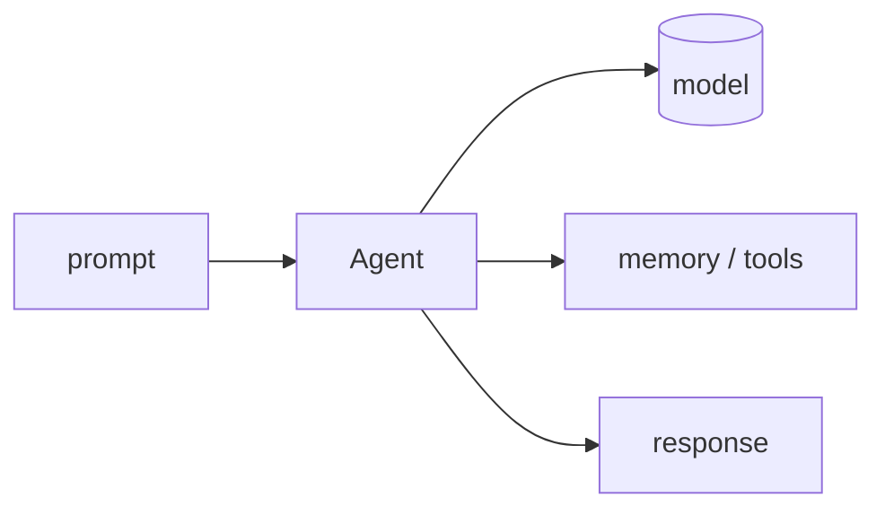

## 개요

Agno(옛 Phidata)는 메모리·지식·도구를 갖춘 에이전트를 만드는 고성능 Python 프레임워크이며, 이를 프로덕션에서 서빙·확장하는 런타임 **AgentOS**를 함께 제공합니다.  
모델에 구애받지 않으며, 속도와 데이터를 자체 인프라 안에 두는 점을 강조합니다.

**코드 샘플** 탭에서 Claude 기반 단일 에이전트를 보여줍니다.

## 언제 쓰면 좋은가

빠르고 기본 기능이 갖춰진 에이전트 추상화와, 데이터를 외부 플랫폼에 보내지 않고
멀티 에이전트 시스템을 배포할 자체 런타임(AgentOS)을 원할 때 Agno를 고르세요.
