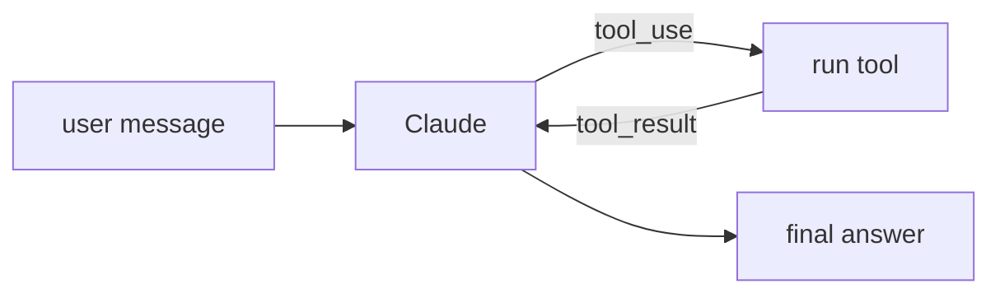

## 개요

Claude는 Anthropic의 프런티어 모델 제품군입니다.  
에이전트 워크로드에서는 안정적인 **도구 사용**(함수 호출), 큰 컨텍스트 윈도, 지시를 잘 따르는 특성 덕분에 좋은 기본 선택지입니다.

자주 쓰는 모델 id(새 에이전트에는 가장 강력한 최신 모델 권장):

- `claude-opus-4-8` — 가장 강력하며, 어려운 추론과 긴 에이전트 루프에 적합
- `claude-sonnet-4-6` — 대량 트래픽 에이전트에 비용/지연이 균형 잡힌 선택
- `claude-haiku-4-5-20251001` — 단순 하위 작업에 가장 빠르고 저렴

**코드 샘플** 탭에는 TypeScript와 Python 예시가 있습니다 —
선택기에서 비교해 보세요.

## 언제 쓰면 좋은가

에이전트가 안정적인 다단계 도구 사용, 세심한 지시 준수, 긴 컨텍스트 문서
추론이 필요할 때 Claude를 선택하세요.
