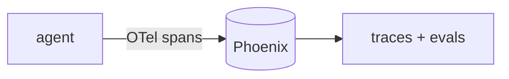

## 개요

Phoenix는 Arize의 오픈소스 LLM·에이전트 관측성 도구로, **OpenTelemetry** 위에 만들어졌습니다.  
각 실행을 중첩 스팬(모델 호출·도구 호출·검색)으로 추적하고, 그 위에 데이터셋과 평가를 더합니다 — 계정 없이 모두 self-host 가능합니다.

**코드 샘플** 탭에는 앱을 계측하는 예시와 로컬 Phoenix 서버 실행 예시가 있습니다 —
선택기에서 골라 비교해 보세요.

## 언제 쓰면 좋은가

로컬이나 self-host로 돌릴 수 있는 개방형 OpenTelemetry 기반 트레이싱·평가가 필요할 때
Phoenix를 쓰세요 — 오픈소스 쪽에서 Langfuse와 가까운 짝입니다.
