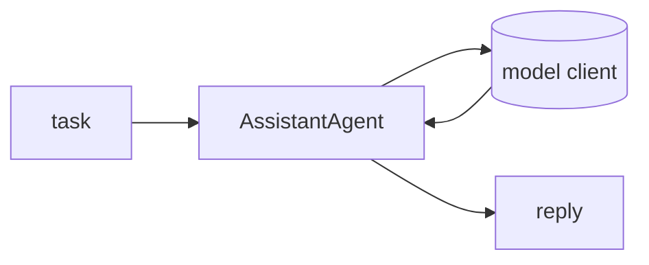

## 개요

AutoGen은 에이전트 간 대화로 멀티 에이전트 시스템을 만드는 Microsoft의 프레임워크입니다 — 이벤트 기반 코어와 상위 수준 AgentChat API로 구성됩니다.  
2025년부터 **유지보수 전용**입니다. 기존 프로젝트는 계속 동작하지만, Microsoft는 신규 개발에 통합 제품인 Microsoft Agent Framework를 권장합니다.

**코드 샘플** 탭에서 단일 에이전트 AgentChat 실행을 보여줍니다.

## 언제 쓰면 좋은가

기존 AutoGen 코드베이스나 대화 중심 멀티 에이전트 패턴에는 여전히 합리적입니다.
신규 프로젝트라면 Microsoft Agent Framework나 활발히 개발되는 CrewAI·LangGraph
같은 대안을 함께 검토하세요.
