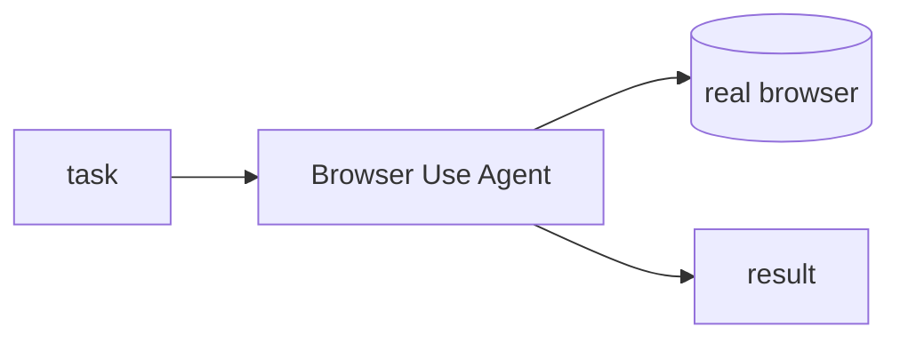

## 개요

Browser Use는 LLM 에이전트가 실제 브라우저를 조작해 웹 작업을 처음부터 끝까지 처리하게 합니다.  
목표를 평범한 문장으로 적으면 에이전트가 페이지를 이동하고 클릭·입력하며 살아 있는 페이지에서 데이터를 뽑아냅니다.

**코드 샘플** 탭에는 LLM 기반 에이전트로 작업을 실행하는 예시가 있습니다.

## 언제 쓰면 좋은가

깔끔한 API가 없는 사이트를 에이전트가 직접 다뤄야 할 때 Browser Use가 잘 맞습니다.
로그인 뒤 스크래핑, 폼 작성, 사람이 클릭으로 거쳐야 하는 여러 단계 흐름에서 특히 빛납니다.
