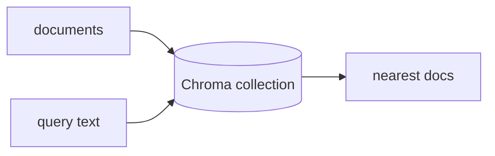

## 개요

Chroma는 오픈소스 임베딩 데이터베이스입니다. 문서를 넣으면 벡터로 저장하고 유사도
질의에 답합니다 — RAG와 에이전트 메모리의 검색 계층입니다.  
별도 서버 없이 인프로세스(메모리 또는 디스크)로 동작하고, 확장이 필요하면 매니지드
클라우드도 제공합니다.

**코드 샘플** 탭에는 기본 임베더와 직접 지정한 임베딩 함수 예시가 있습니다 —
선택기에서 골라 비교해 보세요.

## 언제 쓰면 좋은가

한 줄로 시작할 수 있는 가벼운 임베디드 벡터 스토어가 필요할 때, 그리고 기본 임베더로
부족해지면 임베딩 모델을 직접 끼우고 싶을 때 Chroma를 쓰세요.
