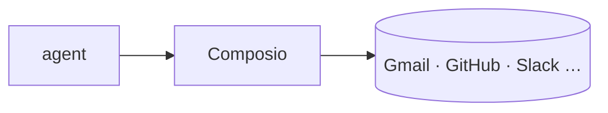

## 개요

Composio는 에이전트에게 1000개 이상 외부 앱에 대한 실제 도구 접근을 제공하는 연동 계층이다.  
준비된 도구 정의를 제공하고 관리형 인증을 처리하므로, 별도 연결 코드 없이도 모델이 Gmail을 읽고 GitHub 이슈를 열고 Slack에 글을 올릴 수 있다.

**코드 샘플** 탭에는 툴킷의 도구를 가져와 LLM이 호출하게 하는 예시가 있습니다.

## 언제 쓰면 좋은가

에이전트가 서드파티 서비스에서 작업을 수행해야 하고, 커넥터를 직접 만들기보다
관리형 OAuth와 도구 스키마를 원할 때 Composio를 고르면 좋다. LangGraph, CrewAI
같은 프레임워크에는 프로바이더 어댑터로 연결된다.
