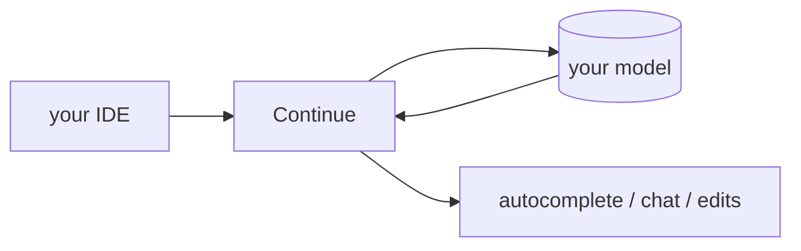

## 개요

Continue는 VS Code와 JetBrains 안에서 동작하는 오픈소스 AI 코딩 어시스턴트로, 인라인 자동완성·채팅·에이전트형 편집을 제공합니다.  
모델에 구애받지 않고 간단한 파일로 설정하므로, 제공자를 직접 고르고 키와 컨텍스트를 로컬에 둡니다.

## 언제 쓰면 좋은가

에디터에 내장된, 커스터마이즈 가능한 오픈소스 어시스턴트를 원할 때 — 자신의
모델과 규칙을 쓰는, 닫힌 자동완성 도구의 셀프호스트 대안으로 Continue를 고르세요.
