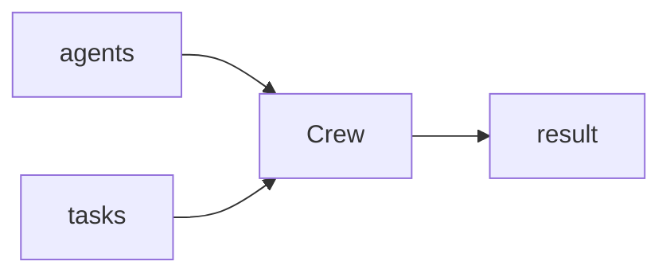

## 개요

CrewAI는 역할이 다른 에이전트들을 **crew**(팀)로 묶어 목표를 향해 협업하게 합니다.  
각 에이전트는 역할·목표·배경을 갖고, crew에 작업 목록을 주면 `kickoff`이 순차 또는 병렬로 실행합니다.

**코드 샘플** 탭에는 단일 에이전트와 멀티에이전트 순차 실행 예시가 있습니다 —
선택기에서 골라 비교해 보세요.

## 언제 쓰면 좋은가

작업이 역할별로 자연스럽게 나뉘고(조사·작성·검토) 그 협업을 고수준으로 배선하고
싶을 때 CrewAI를 쓰세요.
