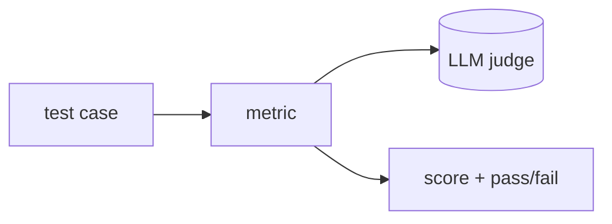

## 개요

DeepEval은 LLM 테스트를 유닛 테스트처럼 다루는 오픈소스 평가 프레임워크입니다 — "LLM용 Pytest" — 관련성·충실도·환각·편향과 커스텀 기준을 위한 지표 라이브러리를 제공합니다.  
로컬과 CI에서 돌아가며, 호스팅 대시보드·회귀 추적을 위한 Confident AI 플랫폼과 짝을 이룹니다.

**코드 샘플** 탭에서 단일 테스트 케이스 채점을 보여줍니다.

## 언제 쓰면 좋은가

평가를 테스트 워크플로에 엮고 싶을 때 — 모델·RAG 출력에 지표 기반 단언을 쓰고 CI를
그에 맞춰 게이트하며, 그 위에 선택적 호스팅 플랫폼을 얹고 싶을 때 DeepEval을 고르세요.
