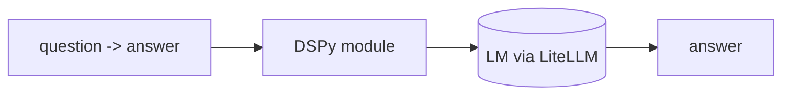

## 개요

DSPy(스탠퍼드 NLP)는 손으로 다듬은 프롬프트 문자열 대신, LM 파이프라인을 타입이 있는 시그니처(`question -> answer`)를 가진 **선언적 파이썬 모듈**로 작성하게 합니다.  
그런 다음 옵티마이저("텔레프롬프터")가 그 모듈을 컴파일하며 — 지표를 기준으로 프롬프트와 few-shot 예시를 탐색해 — 수동 프롬프트 조정 없이 품질을 끌어올립니다.

**코드 샘플** 탭에는 모듈 선언과 옵티마이저 컴파일 예시가 있습니다 —
선택기에서 둘을 비교해 보세요.

## 언제 쓰면 좋은가

깨지기 쉬운 프롬프트 문자열을 관리하기보다 파이프라인을 지표에 맞춰 최적화하고
싶을 때 — 특히 다단계 추론이나 RAG 시스템에 — DSPy를 선택하세요.
