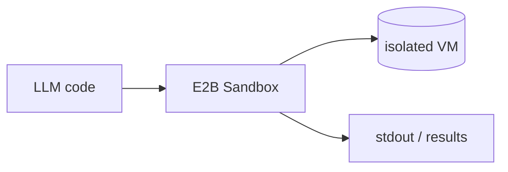

## 개요

E2B는 AI 에이전트가 모델이 생성한 코드를 실행하도록 격리된 클라우드 샌드박스를 제공합니다.  
각 샌드박스는 빠르게 부팅되는 VM이라, 에이전트는 임의의 파이썬을 실행하고 출력을 확인하며 호스트를 건드리지 않고도 호출 간에 상태를 유지할 수 있습니다.

**코드 샘플** 탭에는 샌드박스를 띄우고 그 안에서 코드를 실행하는 예시가 있습니다.

## 언제 쓰면 좋은가

에이전트가 직접 생성한 코드 — 데이터 분석, 스크립트, 도구 호출 — 를 인프라와
분리된 일회용 환경에서 실행해야 할 때 E2B가 잘 맞습니다. 오픈 SDK로 로컬에서
시작하고, 호스팅 샌드박스로 같은 코드를 클라우드에서 확장할 수 있습니다.
