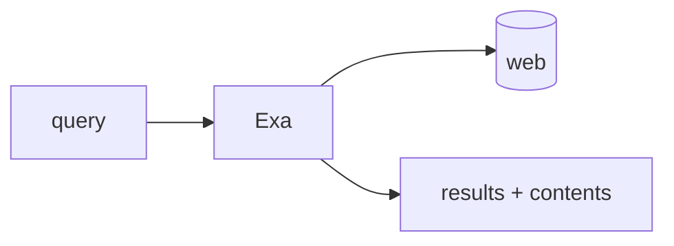

## 개요

Exa는 에이전트와 검색 파이프라인을 위해 만든 뉴럴 웹 검색 API입니다.  
키워드 일치 대신 임베딩 유사도로 페이지를 순위화하며, 같은 요청에서 본문이나 하이라이트까지 돌려주므로 에이전트는 한 번의 왕복으로 바로 읽을 수 있는 컨텍스트를 얻습니다.

**코드 샘플** 탭에는 의미 기반 검색을 실행하고 한 번의 호출로 페이지 본문을 가져오는 예시가 있습니다.

## 언제 쓰면 좋은가

에이전트가 의미로 관련 페이지를 찾아 그 본문을 프롬프트나 RAG 단계에 바로 넣어야 할 때 Exa를 선택하세요. 키워드 검색이 의도를 놓치는 리서치, 그라운딩, 최신성 확인 같은 작업에 잘 맞습니다.
