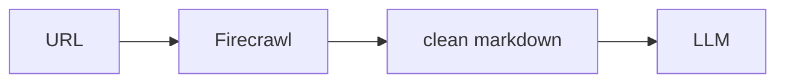

## 개요

Firecrawl은 어떤 URL이나 사이트 전체든 LLM에 바로 쓰는 깔끔한 마크다운이나 구조화 데이터로 바꿔 줍니다.  
페이지 가져오기, 렌더링, 군더더기 제거까지 처리하므로 에이전트는 원본 HTML 대신 읽기 좋은 텍스트를 받습니다.

**코드 샘플** 탭에는 한 페이지를 마크다운으로 스크래핑하는 예시가 있습니다.

## 언제 쓰면 좋은가

검색이나 프롬프트에 쓸 웹 콘텐츠를 깔끔한 마크다운으로 받고 싶고, 스크래핑과
파싱 코드를 직접 짜고 관리하기는 번거로울 때 Firecrawl을 선택하세요.
