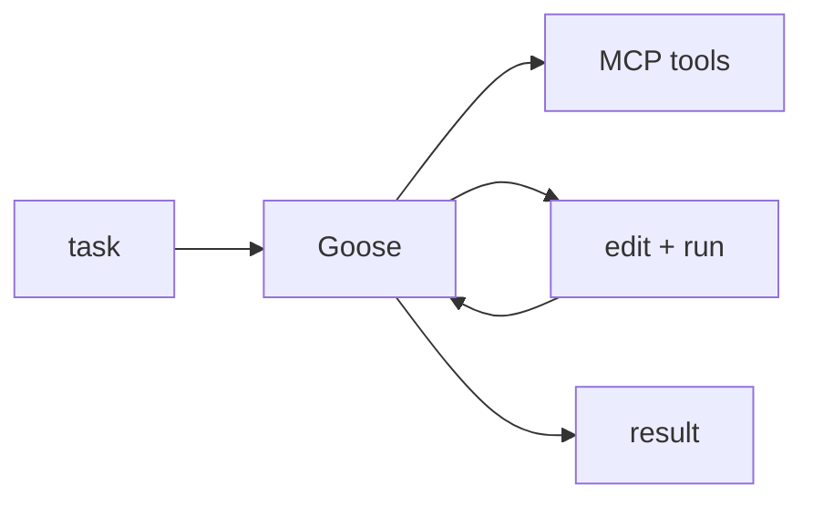

## 개요

Goose는 Block이 만든 오픈소스 코딩 에이전트로, 로컬에서 실제 작업을 수행합니다 — 파일을 수정하고 명령을 실행하며, Model Context Protocol로 도구를 호출합니다.  
모델에 구애받지 않으며(자신의 LLM 키 사용) CLI와 데스크톱 앱으로 제공됩니다.

## 언제 쓰면 좋은가

호스팅 서비스를 끼지 않고, 자신의 모델과 MCP 기반 도구로 개발 작업을 자동화하는
셀프호스트·확장형 에이전트를 원할 때 Goose를 고르세요.
