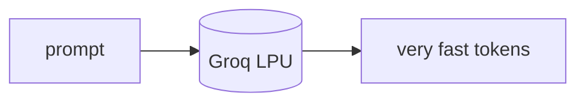

## 개요

Groq는 자체 LPU 하드웨어에서 오픈소스 모델을 구동하는 추론 제공자로, 현존 최고 수준의 토큰 처리 속도를 제공합니다.  
OpenAI 호환 API와 넉넉한 무료 개발자 티어를 제공해, LiteLLM이나 OpenAI SDK로 기존 코드에 그대로 끼워 넣을 수 있습니다.

**코드 샘플** 탭에서 LiteLLM 경유 호출을 보여줍니다.

## 언제 쓰면 좋은가

속도가 최우선이고 오픈 모델(Llama·Qwen 등)이 과제에 맞을 때 — 특히 추론 단계마다
처리량이 시간을 좌우하는 실시간 에이전트에 Groq를 고르세요.
