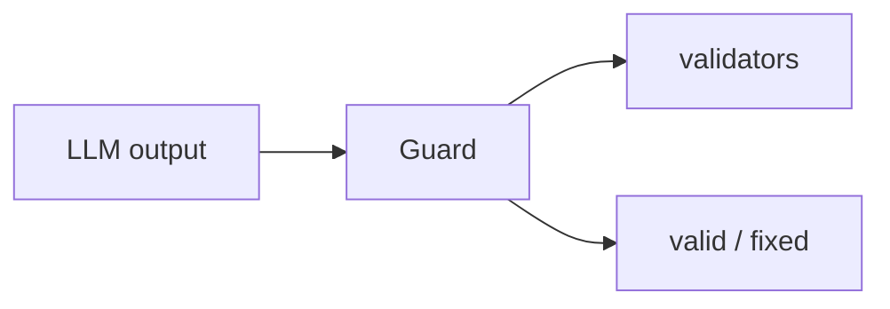

## 개요

Guardrails AI는 Guardrails Hub에서 가져온 조합형 검증기로 LLM 입출력을 검증하고 구조화하는 Python 프레임워크입니다.  
PII·탈옥·형식·사실성 같은 검증기를 모아 `Guard`를 만들면, 모델의 텍스트를 가로채 통과·수정·거부합니다.

**코드 샘플** 탭에는 Hub 검증기로 Guard를 만들고 출력을 점검하는 예시가 있습니다.

## 언제 쓰면 좋은가

LLM 입출력이 PII 제거, 스키마 강제, 탈옥 차단 같은 구체적 규칙을 지켜야 하고,
검사를 직접 짜기보다 Hub의 기성 검증기를 골라 조합하고 싶다면 Guardrails AI가
좋은 선택입니다.
