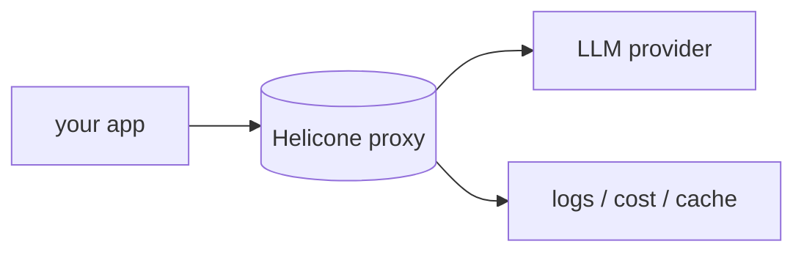

## 개요

Helicone는 프록시로 동작하는 LLM 앱용 오픈소스 관측 플랫폼입니다 — 제공자 호출을 게이트웨이로 보내면 한 줄 변경으로 로깅·캐싱·레이트리밋·비용 추적을 얻습니다.  
매니지드 Helicone Cloud나 셀프호스트로 동작하며, 프록시를 쓰고 싶지 않을 때를 위한 비동기 SDK도 제공합니다.

**코드 샘플** 탭에서 OpenAI SDK 프록시 방식을 보여줍니다.

## 언제 쓰면 좋은가

로깅과 비용 가시성으로 가는 가장 빠른 길을 원할 때 — OpenAI 호환 제공자 앞에
끼우는 게이트웨이로, 데이터 제어를 위한 셀프호스트도 가능합니다.
