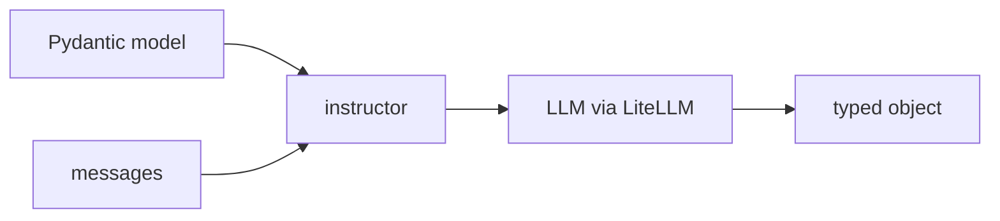

## 개요

instructor는 LLM을 타입이 있는 함수처럼 만듭니다. 출력을 **Pydantic 모델**로
기술하면 자유 텍스트 대신 검증된 파이썬 객체를 돌려줍니다.  
호출을 감싸 — LiteLLM으로 라우팅하며 — 응답이 스키마에 맞을 때까지 다시 요청하므로,
이후 코드가 타입을 신뢰할 수 있습니다.

**코드 샘플** 탭에는 기본 추출과 검증·재시도 예시가 있습니다 — 선택기에서 골라
비교해 보세요.

## 언제 쓰면 좋은가

LLM 출력이 구조를 기대하는 코드로 이어질 때 — 추출·분류·라우팅 — 깨지기 쉬운 JSON
파싱 대신 검증과 재시도를 원한다면 instructor를 쓰세요.
