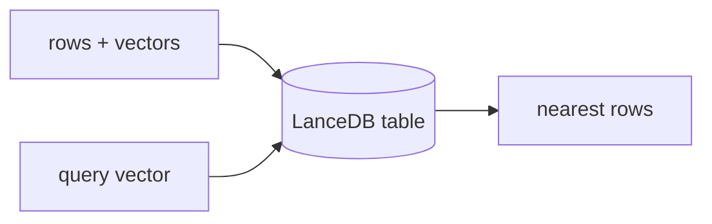

## 개요

LanceDB는 Lance 컬럼형 포맷 위에 만들어진 오픈소스 임베디드 벡터 데이터베이스로, 프로세스 내에서 동작하며 로컬 파일이나 오브젝트 스토리지에 기록합니다 — 운영할 서버가 없습니다.  
멀티모달이고 빠르며, API를 바꾸지 않고 노트북에서 LanceDB Cloud까지 확장됩니다.

**코드 샘플** 탭에서 완전 임베디드 흐름을 보여줍니다.

## 언제 쓰면 좋은가

앱에 내장되는 무운영(zero-ops)·로컬 우선 벡터 스토어를 원할 때 — 데스크톱 도구·
노트북·엣지 배포에 이상적이며, 로컬 파일을 넘어설 때 클라우드 옵션이 있습니다.
