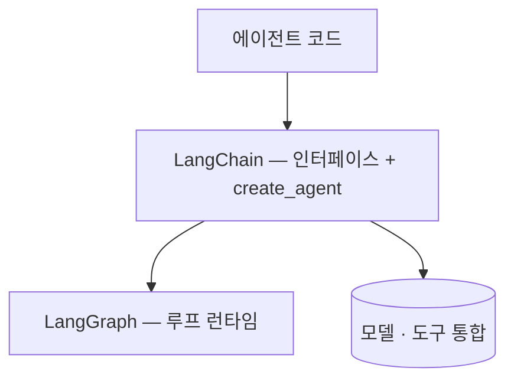

## 개요

LangChain은 패밀리의 나머지가 꽂히는 프레임워크입니다. 챗 모델·메시지·도구의 **표준 인터페이스**와 방대한 공급자·벡터 스토어 통합 카탈로그를 제공합니다.  
1.0부터는 패키지가 의도적으로 얇아졌습니다 — 에이전트 런타임은 [[LangGraph]], 관측은 [[LangSmith]]가 맡고, LangChain은 접착을 담당합니다. `create_agent`가 실전형 ReAct 에이전트를 만들어 컴파일된 LangGraph 그래프로 돌려줍니다.

이 카탈로그의 튜토리얼들이 정확히 그 조합을 씁니다 — 공급자 라우팅은 `ChatLiteLLM`, 루프는 `create_agent`.  
접착 계층이 정말 필요한지는 따져볼 만한 질문인데, [[litellm-langgraph-vs-langchain|LangChain 없이 만들면]]에서 같은 루프를 LiteLLM + LangGraph만으로 배선해 트레이드오프를 비교합니다.

## 언제 쓰나

몇 분 안에 도구 호출 에이전트를 띄우고 싶을 때, 하나의 인터페이스로 모델 공급자 이식성을 얻고 싶을 때, 통합 카탈로그가 필요할 때 LangChain을 집으세요. 루프 자체를 원하는 모양으로 빚어야 하면 LangGraph의 그래프 API로 내려가면 됩니다.
