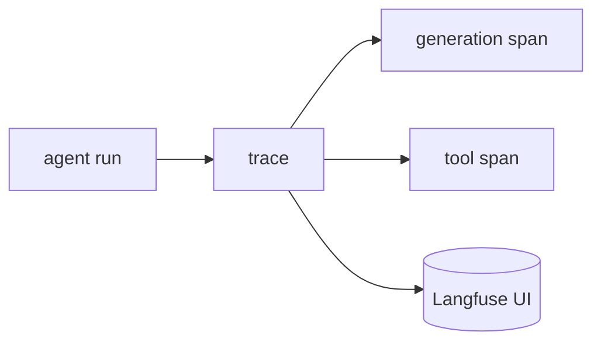

## 개요

에이전트는 로그만으로는 파악하기 어려운 방식으로 실패합니다.  
Langfuse는 각 실행을 중첩된 스팬(모델 호출, 도구 호출, 검색)의 **트레이스**로 기록해, 모든 단계의 지연·비용·정확한 프롬프트/출력을 들여다볼 수 있게 합니다.  
그 위에 점수와 평가를 덧붙일 수 있습니다.

**코드 샘플** 탭에는 TypeScript SDK와 Python 데코레이터 예시가 있습니다 —
선택기에서 비교해 보세요.

## 언제 쓰면 좋은가

다단계 에이전트 실행을 디버깅하거나, 프롬프트 버전을 비교하거나, 프로덕션에서
비용과 품질을 추적해야 할 때 Langfuse를 일찍 도입하세요.
