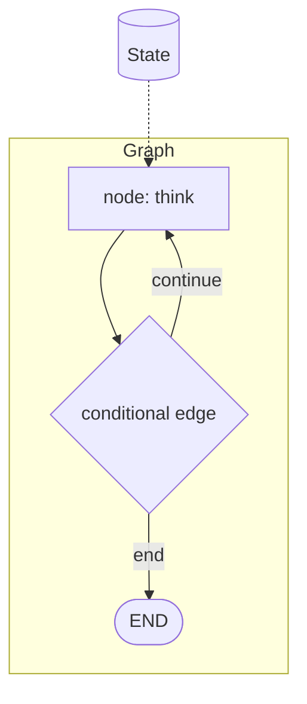

## 개요

LangGraph는 에이전트를 **노드들의 그래프**로 모델링하고 엣지로 연결합니다.
각 노드는 하나의 단계(모델 호출, 도구 실행, 메모리 갱신)이고, 엣지가 다음에
무엇을 실행할지 결정합니다. 상태가 명시적이기 때문에 평범한 while 루프로는
표현하기 어려운 지속적 실행, 루프, 분기, 휴먼 인 더 루프 일시정지를 얻습니다.

**코드 샘플** 탭에는 같은 아이디어를 두 가지 방식으로 작성한 예시가 있습니다 —
선택기에서 API 버전을 골라 비교해 보세요.

## 언제 쓰면 좋은가

에이전트가 여러 단계에 걸친 순환, 재시도, 체크포인트된 상태가 필요할 때 —
즉 단일 선형 프롬프트 체인보다 더 구조적인 흐름이 필요할 때 LangGraph를
선택하세요.
