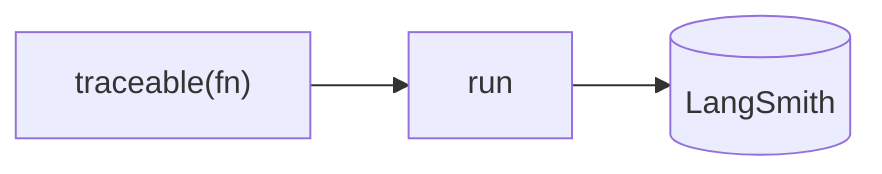

## 개요

LangSmith는 LLM 앱의 운영 측면을 담당하는 LangChain의 호스팅 플랫폼입니다.  
모든 모델·도구 호출을 트레이싱하고, 데이터셋에 대해 평가를 실행하며, 프롬프트를 관리·버전 관리하고, 프로덕션에서 비용과 지연을 모니터링합니다.  
LangChain/LangGraph와 긴밀히 통합되지만 SDK를 통해 어떤 스택과도 함께 쓸 수 있습니다.

**코드 샘플** 탭에는 TypeScript와 Python 예시가 있습니다 —
선택기에서 비교해 보세요.

## 언제 쓰면 좋은가

관리형의, 필요한 기능이 모두 갖춰진 관측성·평가 플랫폼을 원할 때 — 특히 이미
LangChain 생태계를 쓰고 있다면 LangSmith를 선택하세요.

함께 보기: [Langfuse vs LangSmith](../../blog/langfuse-vs-langsmith/).
