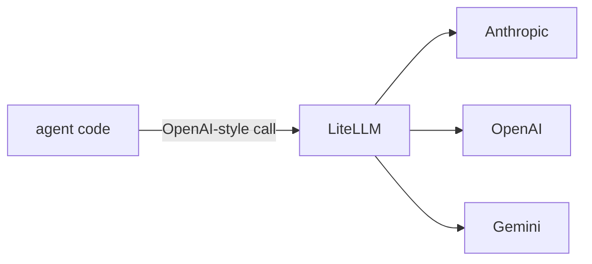

## 개요

LiteLLM은 여러 모델 제공자(Anthropic, OpenAI, Bedrock, Vertex, 로컬 모델 등) 위에 얇은 추상화를 씌워 하나의 OpenAI 호환 호출로 노출합니다.  
SDK뿐 아니라 **프록시 서버**가 LLM 게이트웨이 역할을 합니다 — 로드 밸런싱, 자동 폴백, 재시도, 예산, 키별 비용 추적까지.  
덕분에 에이전트는 코드 변경 없이 모델을 교체할 수 있습니다.

**코드 샘플** 탭에는 LiteLLM을 쓰는 두 가지 방식이 있습니다 —
선택기에서 SDK 호출과 Router 폴백을 비교해 보세요.

## 언제 쓰면 좋은가

에이전트가 제공자에 종속되지 않아야 하거나, 모델 간 폴백이 필요하거나, 예산을
강제하고 지출을 추적할 중앙 게이트웨이가 필요할 때 LiteLLM을 사용하세요.
