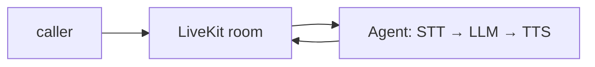

## 개요

LiveKit Agents는 LiveKit WebRTC 스택 위에서 음성·영상·물리 AI 에이전트를 만드는 실시간 프레임워크입니다.  
`AgentSession`이 음성 인식, LLM, 음성 합성을 저지연 파이프라인으로 이어 붙이고, 턴 감지가 내장되어 있어 발신자가 끼어들며 자연스럽게 대화할 수 있습니다.

**코드 샘플** 탭에는 STT·LLM·TTS를 이어 붙인 최소 음성 에이전트 진입점 예시가 있습니다.

## 언제 쓰면 좋은가

턴 기반 텍스트 채팅이 아니라 WebRTC로 동작하는 실시간 음성·영상 대화 에이전트가 필요할 때 LiveKit Agents를 고르세요. 오픈소스 프레임워크를 직접 호스팅하거나, 글로벌 엣지 인프라가 관리되는 LiveKit Cloud에서 운영할 수 있습니다.
