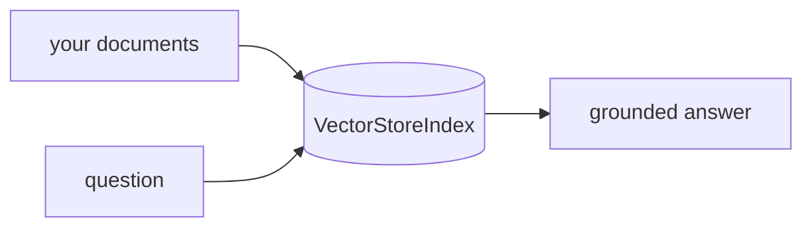

## 개요

LlamaIndex는 LLM을 자체 데이터에 연결하는 데이터 프레임워크입니다 — 문서를 수집·청크·임베딩·색인하고 질의 시 관련 부분을 검색합니다.  
수십 종의 벡터 스토어·데이터 소스 커넥터를 갖춰, RAG 파이프라인과 문서 에이전트를 만드는 가장 일반적인 방법 중 하나입니다.

**코드 샘플** 탭에서 최소 색인·질의 흐름을 보여줍니다.

## 언제 쓰면 좋은가

검색이 앱의 핵심일 때 — 문서·지식베이스·정형 소스에 대한 RAG — 수집과 질의를
성숙한 프레임워크에 맡기고 싶다면 LlamaIndex를 고르세요. LlamaCloud는 호스팅
파싱·색인을 더합니다.
