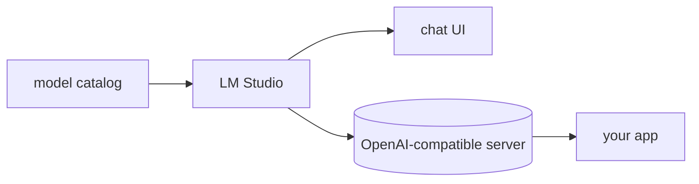

## 개요

LM Studio는 GGUF·MLX 형식의 로컬 LLM을 찾고 내려받아 실행하는 데스크톱 앱(macOS·Windows·Linux)으로, 채팅 UI와 내장 서버를 갖췄습니다.  
서버가 OpenAI 호환이라 기존 코드나 LiteLLM이 클라우드 제공자 대신 `localhost`를 가리키면 됩니다. 개인·상업용 모두 무료입니다.

**코드 샘플** 탭에서 로컬 서버 호출을 보여줍니다.

## 언제 쓰면 좋은가

Ollama 같은 CLI 런타임이나 vLLM 같은 GPU 서빙 엔진보다, GUI로 로컬 모델을
가장 쉽게 둘러보고 내려받아 서빙하고 싶을 때 LM Studio를 고르세요.
