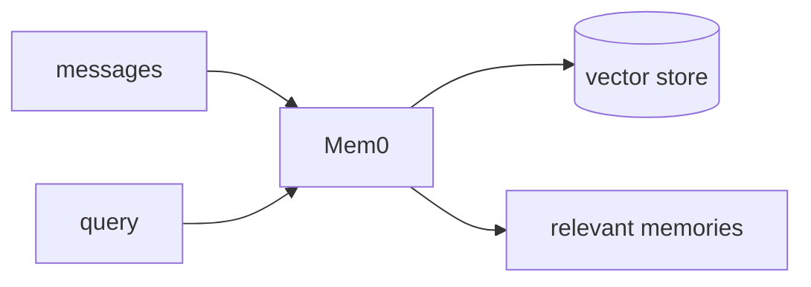

## 개요

Mem0는 에이전트에 장기·사용자별 기억을 주는 메모리 레이어입니다.  
원본 대화 청크를 저장하는 대신, 메시지를 간결한 사실로 추려내는 추출 단계를 거치고 검색 시 관련된 것만 가져옵니다 — 단순 벡터 검색과는 결이 다른 문제입니다.

**코드 샘플** 탭에는 기억을 저장·검색하고 그것을 프롬프트에 넣는 예시가 있습니다 —
선택기에서 골라 비교해 보세요.

## 언제 쓰면 좋은가

매 턴 전체 히스토리를 다시 읽는 대신, 에이전트가 사용자 선호와 사실을 세션을 넘어
기억해야 할 때 Mem0를 쓰세요.
