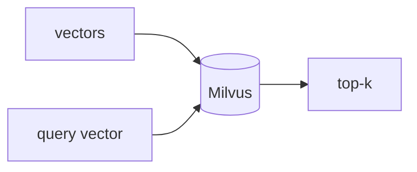

## 개요

Milvus는 대규모 유사도 검색을 위해 설계된 오픈소스 벡터 데이터베이스로, 수십억 개의 벡터를 다루는 분산 아키텍처를 갖췄습니다.  
임베디드(Milvus Lite), 셀프호스트, 매니지드 Zilliz Cloud로 실행하며 세 방식 모두 같은 API를 씁니다.

**코드 샘플** 탭에서 임베디드 Milvus Lite 흐름을 보여줍니다.

## 언제 쓰면 좋은가

매우 큰 컬렉션이 예상되고 검증된 분산 벡터 스토어가 필요할 때 — Milvus Lite로
프로토타이핑한 뒤 코드를 바꾸지 않고 클러스터나 Zilliz Cloud로 확장하세요.
