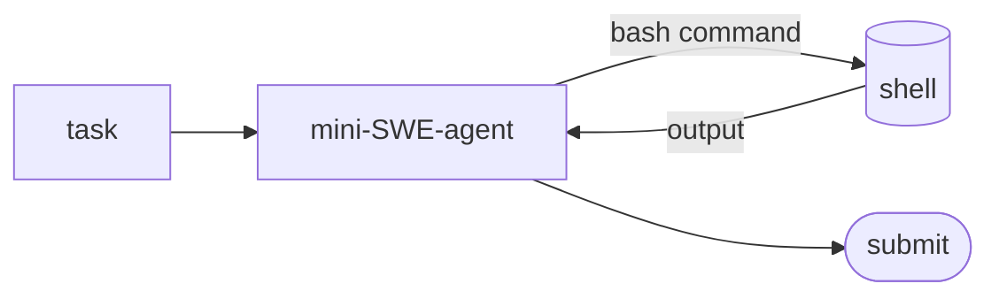

## 개요

mini-SWE-agent는 [SWE-agent](../swe-agent/)의 간결한 후속작입니다.  
모델이 코드를 읽고 편집하고 실행해 GitHub 이슈를 고친다는 핵심 아이디어는 그대로지만, 에이전트 루프를 약 **100줄**로 줄였습니다 — 특수 도구 없이 셸 명령만 사용합니다.  
읽고, 고치고, 배포하기가 더 쉬우면서 SWE-bench에서도 경쟁력을 유지합니다.

**코드 샘플** 탭에는 CLI와 파이썬 바인딩 두 가지 사용법이 있습니다 —
선택기에서 비교해 보세요.

## 언제 쓰면 좋은가

새 작업에는 SWE-agent보다 mini-SWE-agent를 선택하세요 — 활발히 개발되는
쪽이고, 작은 코어 덕분에 이해하고 커스터마이즈하기 쉽습니다.
