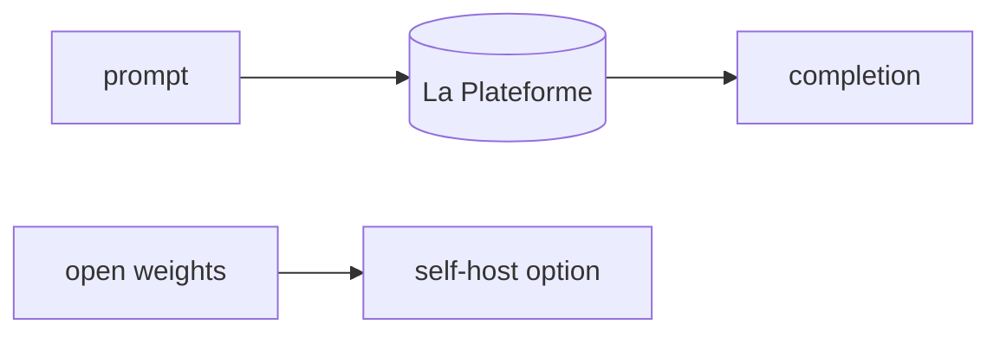

## 개요

Mistral AI는 강력한 오픈 웨이트 모델(Mistral·Mixtral·Codestral)을 호스팅 API La Plateforme와 함께 공개하는 유럽 파운데이션 모델 연구소입니다.  
API는 OpenAI 형태이며 무료 실험 티어가 있고, 오픈 웨이트 모델은 내려받아 셀프호스트할 수 있습니다.

**코드 샘플** 탭에서 LiteLLM 경유 호출을 보여줍니다.

## 언제 쓰면 좋은가

EU 데이터 레지던시를 갖춘 비용 효율적 프런티어 대안을 원하거나, 같은 계열의
오픈 웨이트 모델을 셀프호스트하는 유연성이 중요할 때 Mistral을 고르세요.
