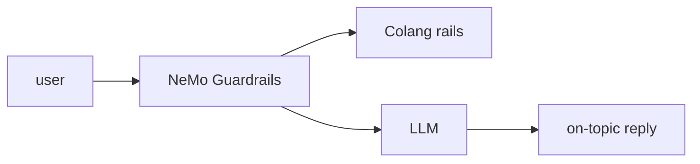

## 개요

NeMo Guardrails는 LLM 기반 대화 앱에 프로그래밍형 가드레일을 더하는 오픈소스 툴킷입니다.  
입력·대화·검색·출력 검사를 Colang으로 정의하면, 라이브러리가 모든 모델 호출 전후에 이를 적용해 응답이 안전하고 주제를 벗어나지 않게 유지합니다.

**코드 샘플** 탭에는 설정을 불러와 가드된 응답을 생성하는 예시가 있습니다.

## 언제 쓰면 좋은가

프롬프트 지시에만 기대지 않고 LLM 대화를 프로그래밍 가능하고 테스트 가능하게 제어해야
할 때 — 주제를 벗어나거나 안전하지 않은 턴을 막고 대화 흐름을 유도하려면 —
NeMo Guardrails를 선택하세요.
