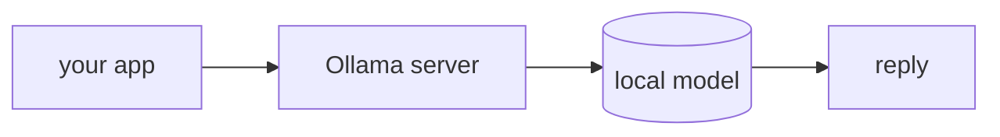

## 개요

Ollama는 오픈 가중치 모델(Llama·Qwen·Gemma 등)을 명령 한 줄로 내 컴퓨터에서 실행하고,
`localhost:11434`에 **OpenAI 호환 API**를 띄웁니다.  
에이전트를 위한 로컬·무키 선택지입니다 — 무료·프라이빗·오프라인이며, 모델 문자열만
바꾸면 LiteLLM 기반 앱에 그대로 들어갑니다.

**코드 샘플** 탭에는 CLI와 LiteLLM 경유 예시가 있습니다 — 선택기에서 골라 비교해
보세요.

## 언제 쓰면 좋은가

오프라인으로 개발하거나, 데이터를 기기 안에 두거나, API 비용을 피하고 싶을 때 Ollama를
쓰세요. 에이전트가 도구 호출이 필요하면 LiteLLM에서 `ollama_chat/` prefix를 쓰세요.
