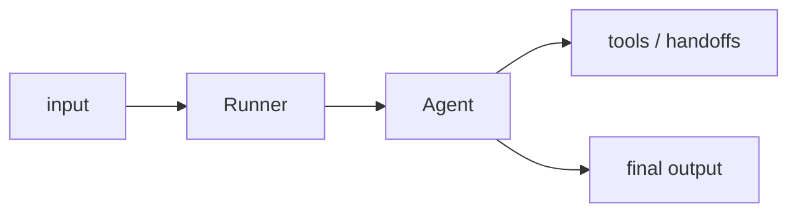

## 개요

OpenAI Agents SDK는 에이전트·도구·에이전트 간 핸드오프·가드레일이라는 몇 가지 기본 요소로 에이전트를 만드는 경량 프레임워크입니다.  
OpenAI의 Swarm 실험을 잇는 프로덕션 지향 후속작으로, 트레이싱이 내장되어 있고 표면적이 작습니다.

**코드 샘플** 탭에서 최소 단일 에이전트 실행을 보여줍니다.

## 언제 쓰면 좋은가

더 큰 오케스트레이션 프레임워크를 도입하지 않고, OpenAI API에 가까운 얇고
조합 가능한 에이전트 루프를 원할 때 — 특히 도구 사용·멀티 에이전트 핸드오프·
가드레일에 적합합니다.
