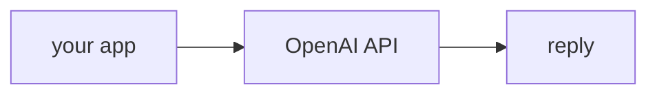

## 개요

OpenAI API는 GPT 모델을 제공하며, 지금 생태계 대부분이 따르는 **chat completions**
형식을 대중화했습니다.  
함수 호출과 구조화 출력을 일급으로 지원하고, 어떤 제공자보다 넓은 도구·통합
생태계를 갖췄습니다.

자주 쓰는 모델 id:

- `gpt-4o` — 대표 멀티모달 모델
- `gpt-4o-mini` — 대량 작업용으로 빠르고 저렴

**코드 샘플** 탭에는 네이티브 SDK와 LiteLLM 경유 예시가 있습니다 — 선택기에서 골라
비교해 보세요.

## 언제 쓰면 좋은가

넓은 생태계 지원과 성숙한 함수 호출이 필요할 때 OpenAI를 쓰고, 나중에 제공자를 바꿀
수 있도록 LiteLLM으로 라우팅하세요.
