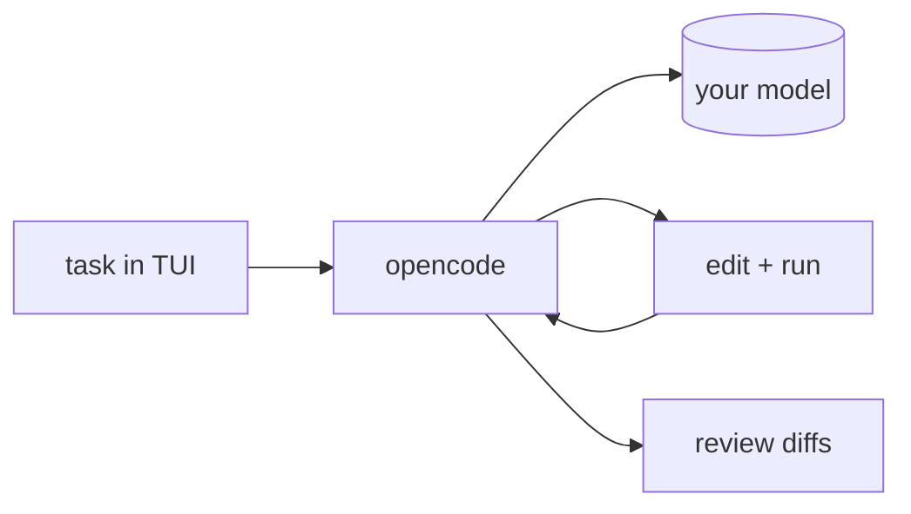

## 개요

opencode는 SST 팀이 만든 오픈소스 터미널 코딩 에이전트로, 빠른 TUI와 클라이언트/서버 구조를 중심으로 설계됐습니다.  
모델에 구애받지 않아 어떤 제공자든 쓸 수 있고, 이미 쓰는 에디터와 함께 동작합니다.

## 언제 쓰면 좋은가

에디터 종속 없이 강력한 TUI를 갖춘 터미널 우선 코딩 에이전트로, 커맨드라인에서
자신의 모델을 구동하고 싶을 때 opencode를 고르세요.
