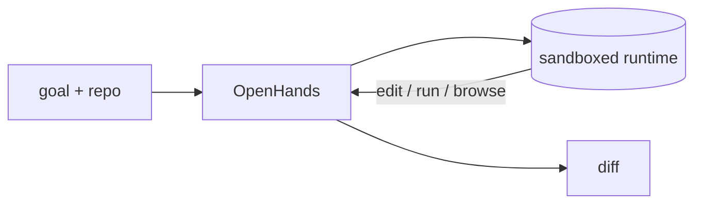

## 개요

OpenHands(이전 이름 OpenDevin)는 개발자처럼 일하는 AI 에이전트를 실행합니다.  
샌드박스 런타임에서 코드를 작성·편집하고 셸 명령을 실행하며, 웹을 탐색하고, 작업이 끝날 때까지 반복합니다.  
목표와 저장소를 주면 다단계 작업을 수행한 뒤 변경 사항(diff)을 보여줍니다.

**코드 샘플** 탭에는 Docker GUI와 헤드리스 CLI 실행 예시가 있습니다 —
선택기에서 비교해 보세요.

## 언제 쓰면 좋은가

단순 파일 편집이 아니라 실제 샌드박스 환경을 갖춘 완전한 자율 코딩 루프와,
에이전트를 감독할 UI가 필요할 때 OpenHands를 선택하세요.
