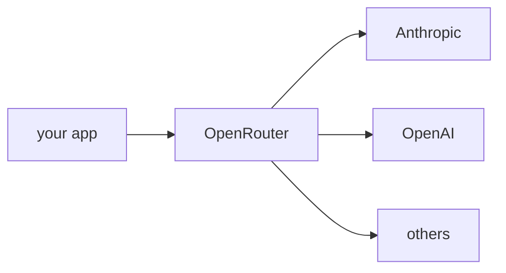

## 개요

OpenRouter는 여러 제공자의 300개 이상 모델을 하나의 **OpenAI 호환** API와 키 뒤에 노출하는 게이트웨이입니다.  
라우팅·자동 폴백·통합 과금을 더해, 에이전트가 계정을 따로 관리하지 않고 Claude·GPT·Gemini·Llama 등에 접근할 수 있습니다.

**코드 샘플** 탭에는 LiteLLM 경유와 OpenAI SDK 경유 예시가 있습니다 — 선택기에서
골라 비교해 보세요.

## 언제 쓰면 좋은가

여러 제공자에 걸쳐 키와 엔드포인트 하나만 쓰고 싶을 때 — 모델 비교, 폴백 추가, 계정
관리 회피 — OpenRouter를 쓰세요.
