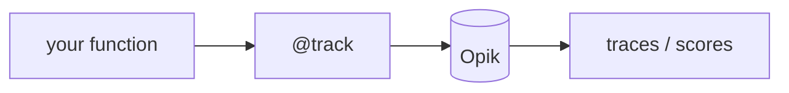

## 개요

Opik은 Comet이 만든 오픈소스 LLM 관측 플랫폼으로, 트레이싱·평가·모니터링을 결합합니다 — 모든 호출을 트레이스로 수집하고 점수를 붙여 프로덕션 대시보드로 지켜봅니다.  
셀프호스트나 매니지드 Comet Cloud로 동작하며, 인기 프레임워크와 `@track` 데코레이터를 지원합니다.

**코드 샘플** 탭에서 `@track`으로 함수를 트레이싱하는 예를 보여줍니다.

## 언제 쓰면 좋은가

트레이싱과 평가를 셀프호스트 가능한 하나의 플랫폼에서 함께 원할 때 — 별도 도구를
엮지 않고, 앱을 프로덕션 모니터링용으로 계측하면서 품질을 채점하고 싶을 때 고르세요.
