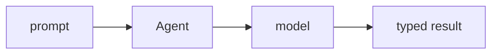

## 개요

Pydantic AI는 Pydantic을 만든 팀의 에이전트 프레임워크로, **타입이 있고 검증된** 결과를 중심으로 설계됐습니다.  
`Agent`에 모델과 (선택적으로) `output_type`을 주면 신뢰할 수 있는 파이썬 객체를 돌려줍니다 — OpenAI·Anthropic·Gemini 등 어디서든.

**코드 샘플** 탭에는 일반 에이전트와 구조화 출력 에이전트 예시가 있습니다 —
선택기에서 골라 비교해 보세요.

## 언제 쓰면 좋은가

무거운 프레임워크보다 파이썬 코드베이스에 잘 맞는 에이전트 — 타입 결과·의존성
주입·검증 — 가 필요할 때 Pydantic AI를 쓰세요.
