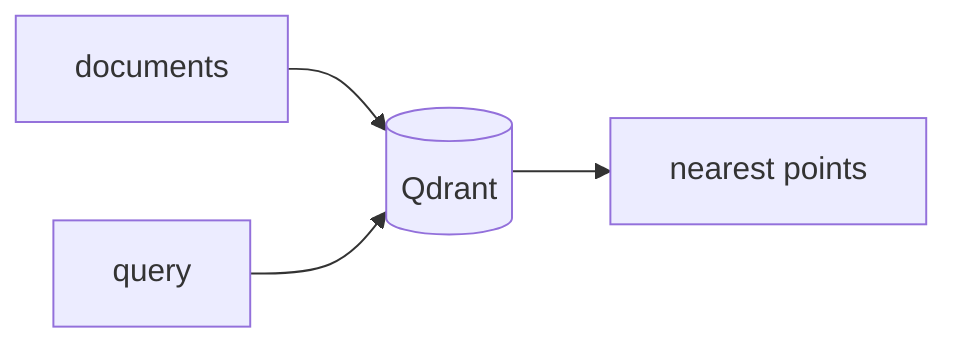

## 개요

Qdrant는 Rust로 작성된 빠른 오픈소스 벡터 데이터베이스로, 대규모 유사도 검색을 위해 만들어졌습니다.  
임베딩을 JSON 페이로드·풍부한 필터링과 함께 저장해, RAG와 에이전트의 검색·장기 기억 계층으로 흔히 쓰입니다.

**코드 샘플** 탭에는 내장 임베더 방식과 직접 벡터를 다루는 방식이 있습니다 —
선택기에서 골라 비교해 보세요.

## 언제 쓰면 좋은가

강력한 성능과 페이로드 필터링을 갖춘 전용 벡터 스토어가 필요할 때 — Docker로
self-host하거나 Qdrant Cloud에서 — Qdrant를 쓰세요.
