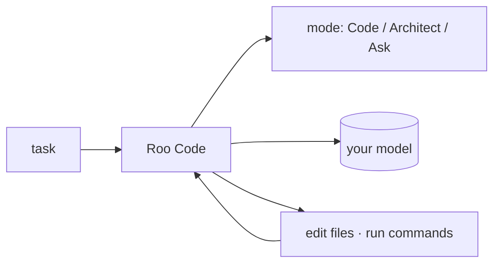

## 개요

Roo Code는 VS Code용 오픈소스 에이전트형 코딩 확장(Cline의 커뮤니티 포크)으로, 프로젝트를 읽고 파일을 수정하며 명령을 실행합니다.  
전환 가능한 **모드**(Code·Architect·Ask 및 커스텀)와 MCP 도구 지원을 더했으며, 모델에 구애받지 않습니다.

## 언제 쓰면 좋은가

동작을 모드와 MCP로 세밀하게 제어하는, 무료 에디터 내장 자율 에이전트를 원할 때 —
호스팅형 IDE 에이전트의 셀프호스트 대안으로 Roo Code를 고르세요.
