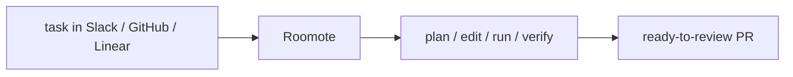

## 개요

Roomote는 Roo Code 팀이 만든 클라우드 기반 자율 코딩 에이전트입니다. Slack·GitHub·Linear에서 작업을 주면 계획·수정·실행·검증까지 끝까지 수행해, 바로 검토할 수 있는 풀 리퀘스트로 돌려줍니다.  
에디터 밖에서 동작하는 클라우드 에이전트에 집중하기 위해 2026년에 종료한 Roo Code VS Code 확장의 후속입니다.

## 언제 쓰면 좋은가

에디터 내장 어시스턴트가 아니라, 이미 쓰는 도구에서 작업을 받아 완성되고 검증된
결과를 돌려주는 자율 에이전트를 원할 때 Roomote를 고르세요. 클라우드에서 인스턴스당
유료 플랜으로 동작합니다.
