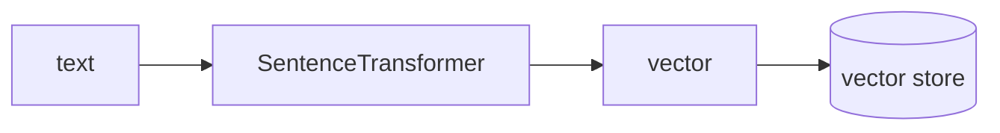

## 개요

Sentence Transformers(SBERT)는 다국어 `bge-m3` 같은 임베딩 모델을 내 컴퓨터에서 직접
실행해, API 호출 없이 텍스트를 벡터로 바꿉니다.  
RAG 파이프라인의 로컬·제공자 독립적인 절반입니다 — 임베딩은 여기서 만들고, 저장·검색은
벡터 스토어에서 합니다.

**코드 샘플** 탭에는 텍스트 인코딩과 내장 유사도 검색 예시가 있습니다 — 선택기에서
골라 비교해 보세요.

## 언제 쓰면 좋은가

비용·프라이버시·오프라인 때문에 호스티드 임베딩 API 대신 로컬에서 임베딩을 계산하고
싶을 때 Sentence Transformers를 쓰세요.
