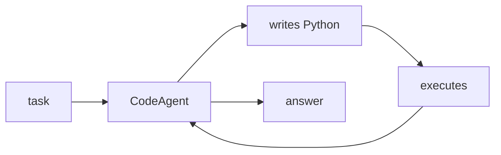

## 개요

smolagents는 의도적으로 아주 작은 Hugging Face 라이브러리입니다 — 에이전트 로직이 약 1,000줄에 담깁니다 — 그리고 **코드 에이전트**, 즉 Python을 작성·실행해 행동하는 방식을 중심으로 설계됐습니다.  
모델에 구애받지 않아 로컬 transformers, Hugging Face Hub 모델, 또는 LiteLLM을 통한 임의 제공자를 쓸 수 있습니다.

**코드 샘플** 탭에서 LiteLLM 기반 코드 에이전트를 보여줍니다.

## 언제 쓰면 좋은가

최소한의, 손대기 쉬운 에이전트 루프를 원하거나, JSON 함수 호출보다 코드 작성
방식이 과제(수학·데이터 가공·다단계 도구 사용)에 더 잘 맞을 때 고르세요.
