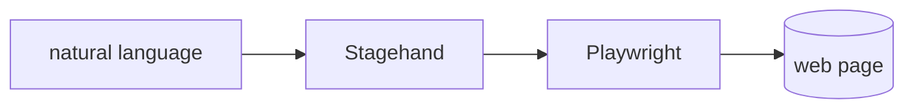

## 개요

Stagehand는 Browserbase가 만든 AI 브라우저 자동화 프레임워크로, Playwright 위에 `act`·`extract`·`observe`를 얹습니다.  
단계를 자연어로 쓰면 Stagehand가 실제 브라우저 동작으로 풀어내며, 페이지가 바뀌어도 스스로 보정합니다.

**코드 샘플** 탭에는 페이지를 조작하고 zod 스키마로 타입이 지정된 데이터를 추출하는 예시가 있습니다.

## 언제 쓰면 좋은가

깨지기 쉬운 CSS·XPath 셀렉터 때문에 스크래퍼와 에이전트가 자꾸 멈춘다면, 상황에
맞춰 적응하는 자연어 단계를 원할 때 Stagehand를 고르세요. 로컬에서는 무료로
돌리고, 관리형으로 확장이 필요하면 Browserbase 클라우드에서 실행하면 됩니다.
