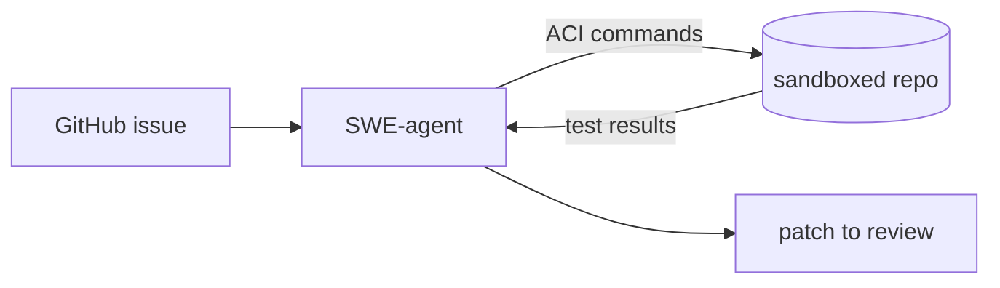

> **유지보수 전용.** SWE-agent는 [mini-SWE-agent](../mini-swe-agent/)로 대체되었습니다 —
> 더 단순하고 유연하면서 성능은 동등합니다. 새 프로젝트는 거기서 시작하세요.
> 이유는 [FAQ](https://mini-swe-agent.com/latest/)를 참고하세요.

## 개요

SWE-agent는 언어 모델에 전용 **에이전트–컴퓨터 인터페이스**(ACI) — 저장소의 파일을 보고, 편집하고, 테스트하는 명령들 — 를 제공해 GitHub 이슈를 처음부터 끝까지 처리하게 합니다.  
다수의 강력한 SWE-bench 결과 뒤에 있는 참조 구현이며, 이슈 해결 에이전트를 만드는 깔끔한 출발점입니다.

**코드 샘플** 탭에 CLI 사용 예시가 있습니다.

## 언제 쓰면 좋은가

작업 단위가 **GitHub 이슈**이고, 자동 버그 수정에 집중한 연구 수준의 벤치마크
가능한 루프를 원할 때 SWE-agent를 선택하세요.
