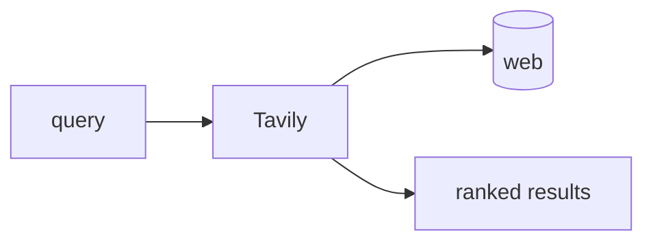

## 개요

Tavily는 LLM·에이전트를 위한 웹 검색 API로, 한 번의 호출로 정제된 랭킹 결과를 RAG에 바로 넣을 수 있게 돌려줍니다.  
원본 HTML을 파싱하는 대신, 점수가 매겨진 스니펫과 출처 URL을 받아 모델에 곧장 넣을 수 있습니다.

**코드 샘플** 탭에는 기본 검색으로 랭킹 결과를 받아 오는 예시가 있습니다.

## 언제 쓰면 좋은가

에이전트가 최소한의 배관만으로 실시간 웹 지식이 필요할 때 Tavily를 쓰세요.
가져오기·랭킹·정제를 대신 처리해 주므로, 스크레이퍼와 파서를 직접 유지보수하는
대신 크레딧을 쓰면 됩니다.
