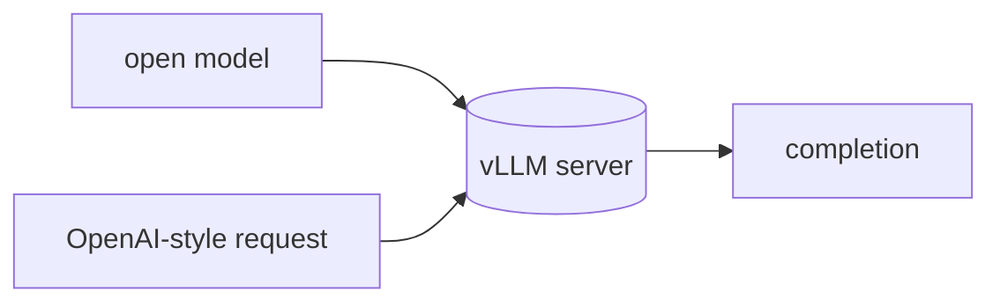

## 개요

vLLM은 LLM을 위한 고처리량·메모리 효율 추론·서빙 엔진으로, PagedAttention과 연속 배칭으로 잘 알려져 있습니다.  
오픈 모델을 OpenAI 호환 API 뒤에서 서빙하므로, OpenAI를 말하는 모든 것(LiteLLM 포함)이 셀프호스트 엔드포인트를 호출할 수 있습니다.

**코드 샘플** 탭에서 모델 서빙과 HTTP 호출을 보여줍니다.

## 언제 쓰면 좋은가

자체 GPU에서 오픈 모델을 돌리며 최대 처리량과 동시성이 필요할 때 — 데스크톱이나
단일 스트림 로컬 런타임이 아니라 프로덕션 셀프호스트 추론에 vLLM을 고르세요.
